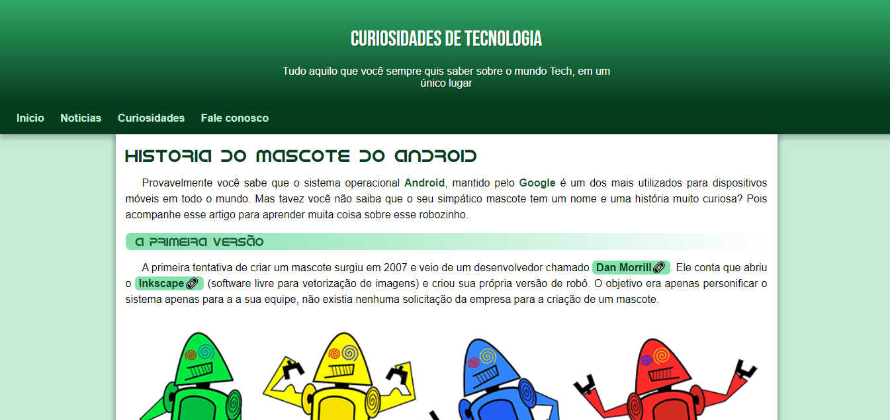

  

## 🖥️ Projeto 
Esse é um projeto Web Reponsivo de site android utilizando conceitos basicos de HTML e CSS.

## 🚀 Tecnologias 
Esse projeto foi desenvolvido durante o Modulo 1 e 2 do Curso em Video utilizando as seguintes tecnologias:

- HTML
- CSS
- Git e Github

